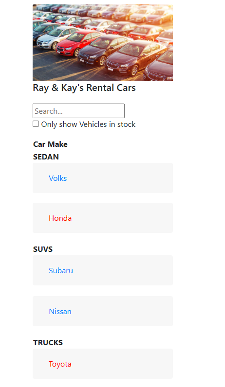

# Car Lot Viewer

## Overview
Car Lot Viewer is a simple React application that allows users to browse and check vehicles available in a car lot. The application displays key details about each vehicle, including its **make, model, year, price, and reviews**. This is a college project utilized to learn ReactJS and uses mock data.

## Features
- View a list of available vehicles
- Display details such as make, model, year, and price
- Read reviews about each vehicle
- Responsive design for optimal viewing on different screen sizes

## Technologies Used
- React.js
- HTML/CSS
- JavaScript

## Installation & Setup
### Prerequisites
Make sure you have **Node.js (version 14 or later)** and **npm** installed on your machine.

### Steps to Run the Project
1. Clone the repository:

2. Navigate to the project folder:

3. Install dependencies:
   ```
   npm install
   ```
4. Start the development server:
   ```
   npm start
   ```
5. Open your browser and go to:
   ```
   http://localhost:3000
   ```

## Usage
- Browse the vehicle listings
- Click on a vehicle to see more details
- Check the reviews before making a decision

